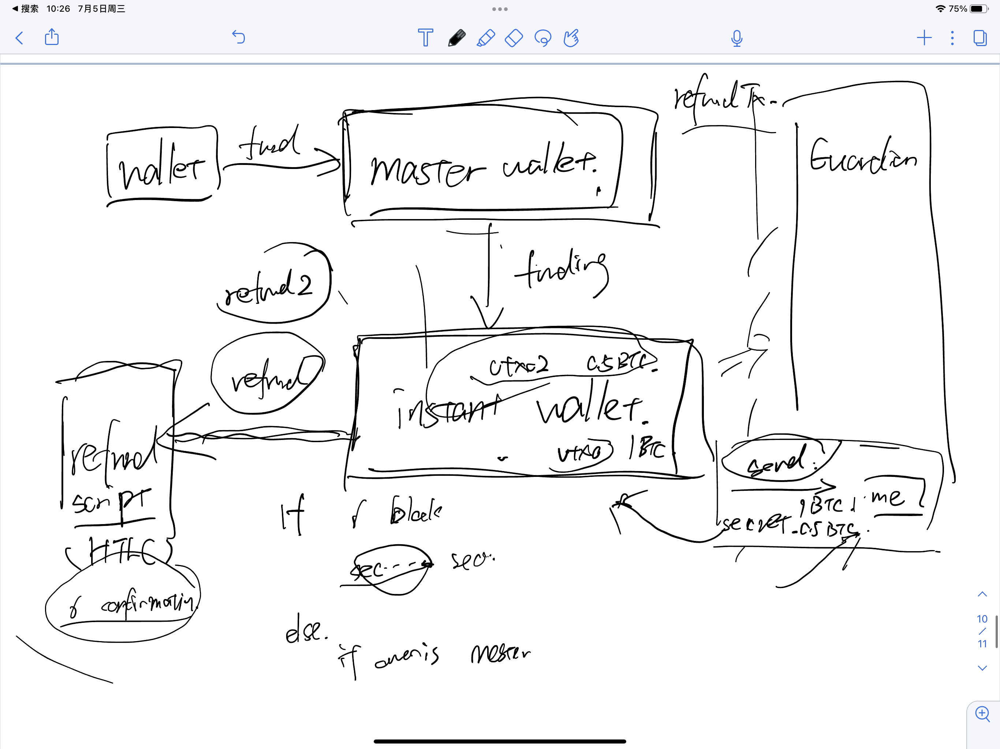

# Introduction

An Instant Wallet is a 2-of-2 multi-sig wallet which enables instant transfers and cross-chain swaps, without requiring any form of trust. It does this through the use of the [Catalog Guardian](guardian), which allows users to bypass confirmation delays. All of the below operations are entirely trustless, and the user maintains full ownership of their funds at each and every step.

## Funding

Before a user funds an Instant Wallet, they send a request to the Guardian to sign a refund transaction in the event the Guardian stops signing transactions or goes offline. This transaction can be signed by the user at any point to withdraw their funds. Once the user has received this transaction, they can safely fund their Instant Wallet knowing they will have full control of their assets through the entire process.

## Sending

When a user wishes to send funds to another address, they simply sign the transaction and send it to the Guardian. The Guardian then verifies that the transaction is not attempting a double-spend, in which case it provides the second signature and gives an instant guarantee to the user that it will be executed. This mechanism enables Catalog's cross-chain swaps which do not involve confirmation delays.

## Refunding

When a user wishes to withdraw their funds from their Instant Wallet, they simply sign and submit the pre-signed refund transaction provided by the Guardian.