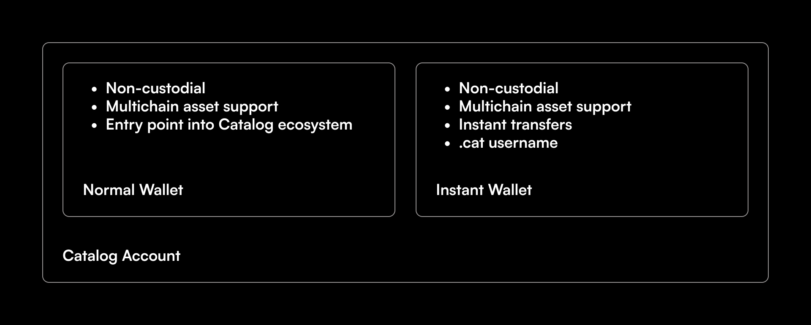

# Introduction

Catalog Accounts underpin the way users interact with Web3 through Catalog. These are non-custodial accounts that allow users to store assets from any blockchain, and send them without waiting for confirmation delays.

