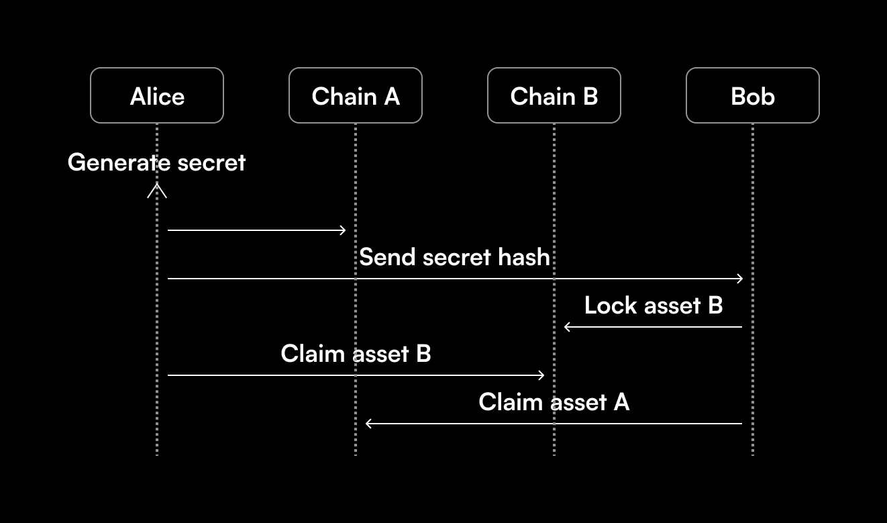

# HTLCs

Catalog Swaps use hashed timelock contracts (HTLCs) for execution, which function as a two-way virtual safe.

## How do they work?

To explain the process of initiating a Catalog Swap, let's take a simple example where Alice and Bob have agreed to trade BTC and ETH.

The first step is for Alice to create a HTLC where she will send her BTC. Once she has deposited the funds, the contract generates a special key that only Alice can access. This key unlocks the funds that Alice sent to the contract. The contract generates a hashed representation of the key, which Alice sends to Bob. This allows Bob to confirm that Alice has locked the funds in the contract, but he cannot access or withdraw the funds yet. After receiving the hashed key, Bob uses it to generate a contract address, where he can deposit his ETH. Since both parties have locked their funds in the HTLCs, all that's left is for Alice to claim the ETH. She can do this because she has access to the key used by Bob to lock his coins. In the process of unlocking Bob's funds, Alice reveals the special key to Bob. Bob can use this key to claim the BTC and finalize the trade.

HTLCs generally enable a free-option opportunity where a user can delay or back out of a swap after both users have collateralized, based on whether the exchange rate has moved since the time the parties formed the agreement. Catalog prevents this through its confirmationless transactions, meaning signatures for initiation and redemption can be collected instantly. This reduces the window of opportunity for users to take advantage of this option, and means the parties are not required to remain online for the settlement of the swap.
