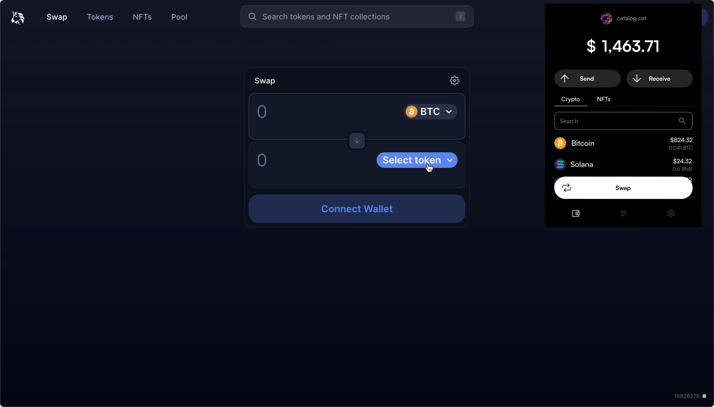

# Catalog Wallet

Catalog Wallet is a browser extension that enables seamless support for cross-chain assets on all dApps, meaning you can transact Bitcoin and other assets directly on your favorite exchange or NFT marketplace. Catalog Wallet uses Catalog Accounts under the hood, abstracting away all of the powerful technology that make your multichain experience possible.

Catalog Wallet is just one example of the types of powerful cross-chain technologies that can be enabled by the Catalog protocol. [Join the waitlist](https://catalog.fi) to be notified when Catalog Wallet is available for download!
